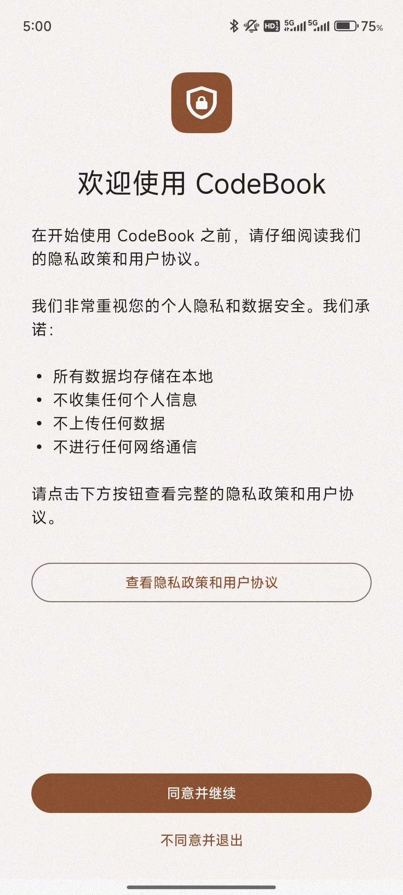
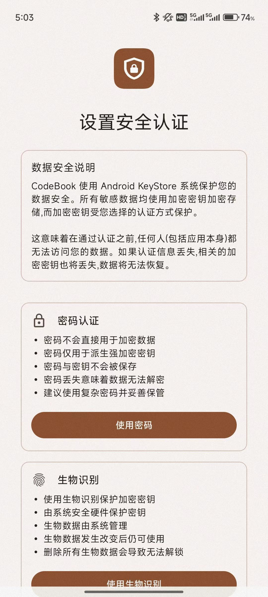

# CodeBook 快速开始

欢迎使用 **CodeBook**！本指南将引导您从安装到熟练使用各项功能，全面了解如何保护和管理您的密码与数字身份信息。

---

## 📥 安装 CodeBook

### 方法一：通过 Google Play 安装
前往 [Google Play Store](https://play.google.com/store/apps/details?id=com.xuanran.codebook)，下载安装 CodeBook 应用。

### 方法二：下载安装 APK
若无法访问 Google Play，您可以通过以下链接下载 APK 包：  
👉 [官方下载 APK](https://codebook.xuanran.cc/app.apk)

下载完成后，请根据手机系统提示完成安装，并确保允许“未知来源应用”的权限。

---

## ✅ 启动前准备

在使用 CodeBook 前，您需要先阅读并同意我们的《隐私政策》和《用户协议》。

---

## 🔐 初始设置

### 选择认证方式

启动 CodeBook 后，您需要**在主密码与指纹识别之间选择一种认证方式**。二者不可同时启用。

#### 选项一：主密码认证
- 用于加密密钥的派生，不直接参与数据加密
- 密码不会被保存，遗忘将导致无法解密数据
- 建议使用 12 位以上复杂密码，并妥善保存

> 💡 您需要先设置锁屏密码后才能启用主密码认证。  

#### 选项二：指纹识别（生物识别）  
- 基于 Android 系统生物识别认证  
- 使用 Android KeyStore 中由硬件保护的密钥加密您的数据  
- 若设备删除所有生物数据，将无法解锁应用，需重新设置认证方式

---

## 🛡 安全说明

CodeBook 的数据安全依托于 Android 系统的 KeyStore 技术：

• 所有敏感数据均加密存储  
• 加密密钥受所选认证方式（密码或指纹）保护  
• 认证信息丢失即意味着密钥丢失，数据不可恢复  
• 应用本身也无法在未认证时访问您的数据

---

## ✨ 基本功能使用

### ➕ 添加密码

1. 打开 CodeBook，点击右下角的 **“+”**
2. 选择“密码”类型
3. 填写：
   - 应用/网站名称
   - 用户名 / 邮箱
   - 密码（可点击右侧图标使用生成器）
   - 可选备注
4. 点击 **“保存”**

> **📸 建议配图 6**：添加密码界面填写示例

---

### 🔐 添加 TOTP 动态令牌

1. 在主界面点击 **“+”** → 选择 **“安全令牌”**
2. 使用摄像头扫描二维码，或手动输入密钥
3. 系统自动生成动态码
4. 确认有效后点击保存

> **📸 建议配图 8**：扫码添加 TOTP 的页面 + 验证界面

---

## 📂 数据管理

### 分类整理
- 使用“文件夹”组织不同用途密码
- 为条目添加自定义“标签”
- 使用顶部搜索栏快速查找

> **📸 建议配图 9**：文件夹与标签示例

---

### 数据备份

1. 设置 → 选择“备份与恢复”
2. 创建备份密码（用于加密备份文件）
3. 选择本地或云端存储位置
4. 点击“开始备份”

> **📸 建议配图 10**：备份操作流程截图

---

### 导入密码数据

1. 从 Chrome、1Password、Bitwarden 等导出 CSV 文件
2. 在 CodeBook 中选择“导入”
3. 上传 CSV 文件 → 选择对应源格式 → 导入完成

> **📸 建议配图 11**：导入流程（文件选择界面）

---

## 🔒 安全建议

### 日常使用习惯
- 定期更换重要账号密码
- 使用生成器生成唯一强密码
- 每周进行一次数据备份
- 离开设备时及时手动锁定应用

### 注意事项
- 不要在“Root”设备或不可信手机上使用
- 主密码请勿与他人分享
- 将备份文件妥善存放（建议使用云盘+本地双备份）

> **📸 建议配图 12**：安全建议插画或图标合集

---

## 🌟 进阶功能

### 密码健康检查

- 检查所有条目的强度评分
- 标记重复使用的密码
- 自动检测泄露密码（通过内置数据库）
- 提供修改建议与生成新密码入口

> **📸 建议配图 13**：密码健康报告页面

---

### 安全设置

- 自动锁定时间配置（可设为 1 分钟、5 分钟等）
- 应用锁定方式选择：密码 / 生物识别
- 设置在不活跃时自动退出
- 控制自动填充在哪些应用中启用

> **📸 建议配图 14**：安全设置界面

---

## 💬 获取帮助

如遇到任何问题，您可以：

- 查阅[常见问题](/zh/faq)
- 加入[用户社区](https://github.com/xuanran0808/CodeBook/discussions)进行交流
- 或发送邮件至：📧 xuanran0808@gmail.com

---

## 🚀 下一步推荐

- 🔐 [了解 CodeBook 安全特性](/zh/introduction/security-features)
- 🛠 [查看全部功能](/zh/features/password-management)
- 📘 [阅读最佳实践指南](/zh/best-practices)